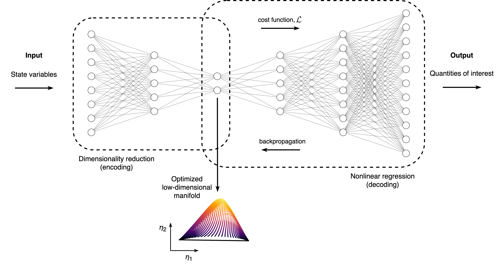

# Regression-aware autoencoder

Code and materials for the paper *Reduced-order modeling with a regression-aware autoencoder*.

## Our methodology

## Code

► [Illustrative example of performing dimensionality reduction with a regression-aware autoencoder on a synthetic 2D dataset](code/illustrative-example-on-a-synthetic-2D-dataset.ipynb)
